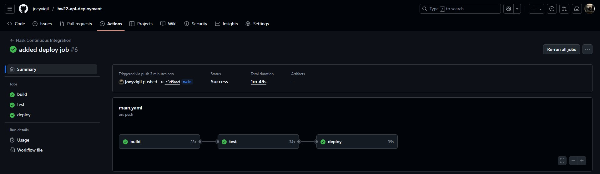
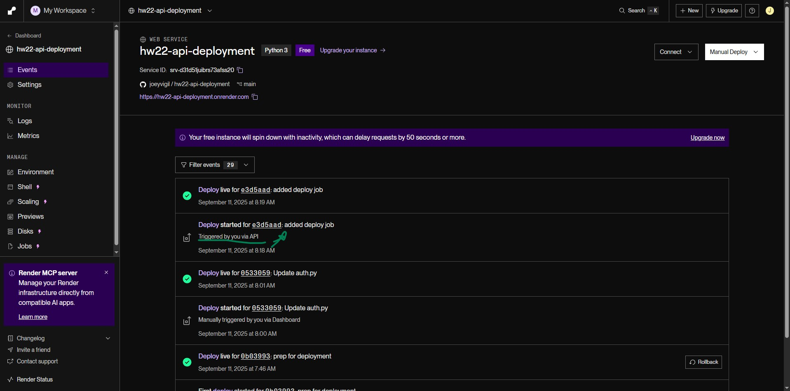
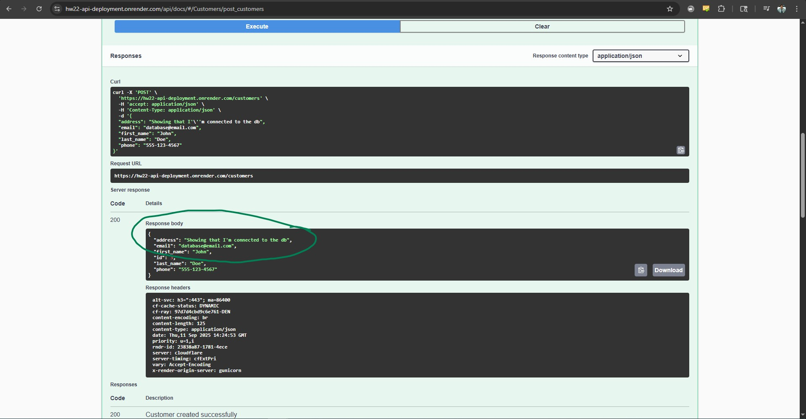

# hw22-api-deployment
In this lesson you will be creating your own CI/CD Pipeline as we did in class (Feel free to follow along in the recording). 

view deployed swagger doc on https://hw22-api-deployment.onrender.com/api/docs

## 10-13-2024
1. created new render database **mechanic_db2**
2. get service id from new db, -> add to github secrets as SERVICE_ID
3. get external db url from new db -> add to render web service environment variables as SQLALCHEMY_DATABASE_URI
4. pushing commit now to trigger github actions

## Completed CI/CD

### Complted Build Test Deploy Pipeline on Github


### Deployed via Render API


### Live API on Render connected to Postgresql Database


## You will
-   Host a database to Render
-   Create your production config
-   Install gunicorn psycopg2 python-dotenv (freeze to your requirements.txt and manually remove python-dotenv)
-   Store sensitive information as an environmental variable in your .env file (database uri and secret key)
-   add .env to your .gitignore
-   Use the os package to retrieve those environmental variable
-   Rename app.py to flask_app.py
-   Pass your ProductionConfig into your create_app function inside flask_app.py
-   Remove app.run() from flask_app.py
-   Push to your github repository
-   Deploy a Web Service on Render using the link to your github repository (make sure to add your environment variables during the deploy process).
-   After successful deployment adjust your swagger documentation host from 127.0.0.1:5000 to the base url of your live API (base url should not include https://)
-   Change your swagger schemes from http to https

## CI/CD Pipline:
-   Create .github folder with a workflows folder inside
-   Create a main.yaml file inside the workflows folder.
-   In the main.yaml file create a workflow including:
-   ---- name: name of workflow
-   ---- on: trigger for workflow
-   ---- jobs: Create the build and test jobs 
-   Store the Render SERVICE_ID and RENDER_API_KEY as secrets in your github repository
-   Set up the deploy job in your .github/workflows/main.yaml and make it dependant on the test job needs: test

## Submission:
After deploying submit the link to your deployed service as well as the the link to your github repository.

## Steps
1. Copy .github/workflows/main.yaml 
2. Create render postgresql db, get external db url, this will be your SQLALCHEMY_DATABASE_URI
3. change production config to :
```python
class ProductionConfig:
    SQLALCHEMY_DATABASE_URI =  os.environ.get('SQLALCHEMY_DATABASE_URI') or 'sqlite:///app.db'
    CACHE_TYPE = "SimpleCache"
```
4. change secret key in auth file to:
```python
SECRET_KEY = os.environ.get('SECRET_KEY') or 'super secret key'
```
5. run pip installs and freeze requirements
```shell
pip install psycopg2
pip install gunicorn
pip freeze > requirements.txt
```
6. change swagger file to render url and http -> https
7. add SQLALCHEMY_DATABASE_URI and SECRET_KEY to render web service environment variables
8. add Service ID (from render) and api key (from render) to secret variables on github
9. commit, push (may want to run each yaml job one at a time so you can catch any errors)